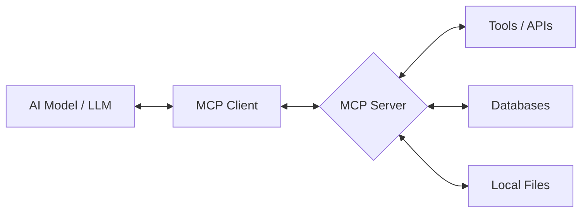

# 🛠️ MCP Studio

**The ultimate developer toolkit to Generate, Validate, and Test Model Context Protocol (MCP) servers with ease.**

[](https://vitejs.dev/)
[](https://reactjs.org/)
[](https://opensource.org/licenses/MIT)

---

## 🌟 Overview

**MCP Studio** is a comprehensive developer platform designed to streamline the lifecycle of building [Model Context Protocol (MCP)](https://modelcontextprotocol.io/) servers. 

Building MCP servers often involves complex JSON configurations and manual schema validation. MCP Studio removes this friction by providing:
- **AI-Powered Generation**: Describe your server in natural language.
- **Visual Builders**: Build tools and resources using structured forms.
- **Instant Validation**: Ensure your server definitions strictly follow the MCP schema.
- **Tool Simulation**: Test your server's logic without a single line of deployment code.

---

## 🚀 Key Features

### 🧠 Server Definition Generator
Generate production-ready MCP server definitions instantly.
- **Natural Language Input**: "Create a GitHub integration server that can list repositories and create issues."
- **Structured Forms**: Manually define tools, resources, and prompts with a clean UI.
- **Instant Preview**: See your JSON schema update in real-time.

### 🔍 MCP Validator
Stop debugging cryptic JSON errors. Our validator provides:
- **Schema Compliance**: Checks against the official MCP specification.
- **Deep Inspection**: Validates `inputSchema`, missing fields, and transport configurations.
- **Human-Readable Errors**: Clear feedback on exactly what needs fixing.

### 🧪 Tool Simulator
Test your tools before they touch production.
- **Dynamic Form Generation**: Automatically creates UI from your tool's `inputSchema`.
- **Logic Verification**: Mock responses and verify how your tools handle different inputs.
- **Fast Iteration**: Refine your tool definitions in seconds.

### 🖼️ Examples Gallery
Jumpstart your development with community templates.
- **Reference Implementations**: Explore production-ready MCP servers for GitHub, Google Drive, and more.
- **One-Click Inspiration**: Copy and modify existing schemas to fit your needs.

### 💬 Client Connection Helper
Easily connect your MCP server to popular AI clients.
- **Config Generator**: Get the exact JSON snippet for Claude Desktop, IDE extensions, or custom clients.
- **Step-by-Step Guides**: Integrated tutorials for various integration scenarios.

---

## 🗺️ How it Works

The Model Context Protocol acts as the bridge between LLMs and your data/tools.



1. **Design**: Use the **Generator** to define your tools and resources.
2. **Validate**: Run the definition through the **Validator**.
3. **Simulate**: Test the interaction flow in the **Simulator**.
4. **Deploy**: Use the **Connection Helper** to integrate with your AI client of choice.

---

## 🛠️ Tech Stack

- **Frontend**: React (v19) + Vite
- **Styling**: Vanilla CSS 
- **Routing**: React Router

---

## 📥 Getting Started

### Prerequisites
- [Node.js](https://nodejs.org/) (v18 or higher)
- npm or yarn

### Installation

1. **Clone the repository**
   ```bash
   git clone https://github.com/yourusername/mcp-studio.git
   cd mcp-studio
   ```

2. **Install dependencies**
   ```bash
   npm install
   ```

3. **Start the development server**
   ```bash
   npm run dev
   ```
   🚀 Open [http://localhost:5173](http://localhost:5173) in your browser.

---

## 📁 Project Structure

```text
mcp-studio
├── src/
│   ├── components/    # Reusable UI elements (Navbar, Footer, Buttons)
│   ├── pages/         # Feature-specific views
│   │   ├── Generator/ # MCP Server Generator logic
│   │   ├── Validator/ # Schema validation tools
│   │   └── Learn/     # Documentation & Tutorials
│   ├── assets/        # Global styles & Media
│   └── App.jsx        # Root routing & Layout
├── public/            # Static assets
└── vite.config.js     # Build configuration
```

---

## 🛣️ Roadmap

- [ ] **Templates Marketplace**: One-click starting points for common integrations (Notion, Jira, Airtable).
- [ ] **Visual Tool Builder**: Drag-and-drop tool definition interface.
- [ ] **MCP Playground**: Interactive environment to test servers against live LLMs.
- [ ] **Export to TS/JS**: Convert your JSON definitions into boilerplate code.
- [ ] **VS Code Extension**: Bring MCP Studio directly into your editor.

---

## 🤝 Contributing

We welcome contributions of all kinds! 

1. **Fork** the project.
2. **Create** your feature branch (`git checkout -b feature/AmazingFeature`).
3. **Commit** your changes (`git commit -m 'Add some AmazingFeature'`).
4. **Push** to the branch (`git push origin feature/AmazingFeature`).
5. **Open** a Pull Request.

---

## 📄 License

This project is licensed under the MIT License - see the [LICENSE](LICENSE) file for details.

---

## 👨‍💻 Author

**Sooraj**
- [GitHub](https://github.com/sooraj-suresh-dev)

*Built with passion for the AI developer ecosystem.*
